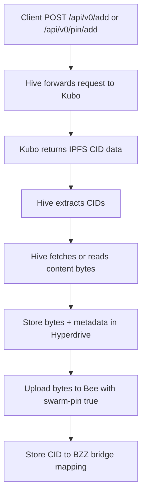
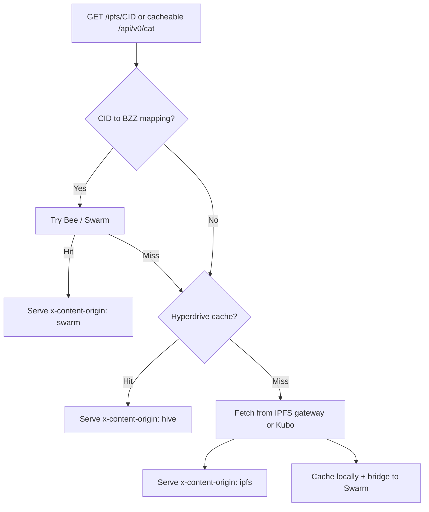

# Hive

Hive is decentralized IPFS pinning powered by [Swarm](https://www.ethswarm.org/).

It addresses the centralization of hosted IPFS pinning services by mirroring IPFS content into Swarm through Bee, keeping a Hyperdrive-backed local cache, and serving bridged IPFS reads with a Swarm-first workflow.

Hive sits in front of a Kubo node and a Bee node. IPFS clients can keep using familiar gateway and selected `/api/v0/*` flows, while Hive stores local bridge state and pins mirrored content into Swarm.

## Why Hive

IPFS is decentralized at the content-addressing layer, but production persistence often depends on centralized pinning providers. Hive keeps the IPFS-facing workflow familiar while using Bee/Swarm as the persistence layer behind pinned content.

- Pinning is centralized in practice when teams depend on hosted pinning services.
- Persistence becomes tied to provider accounts, API keys, quotas, billing, and dashboards.
- Gateway reads are brittle when the upstream gateway, pinning provider, or API is unavailable.
- Swarm and IPFS are useful together, but their APIs and references need a bridge.

## What Hive Does

- Accepts IPFS gateway and selected Kubo API requests.
- Mirrors IPFS content into Bee/Swarm with `swarm-pin: true`.
- Stores `CID -> BZZ hash` bridge mappings.
- Keeps a local Corestore/Hyperdrive cache of bytes, metadata, and refs.
- Serves bridged IPFS reads from Swarm first, then local cache, then IPFS fallback.
- Caches successful Bee reads locally for outage resilience.
- Publishes indexed IPFS directory content as Swarm collection manifests.

Hive delegates network economics and participation to Bee/Swarm. Hive pays for writes with a configured postage stamp, stores the resulting BZZ references locally, and uses Bee as the permissionless Swarm network interface.

## Architecture

```mermaid
flowchart LR
    C[IPFS / app clients] --> H[Hive NestJS + Fastify]
    H --> K[Kubo gateway + API]
    H --> B[Bee API / Swarm]
    H --> D[Corestore + Hyperdrive]
    D --> C1[/content/<checksum>]
    D --> M1[/meta/<checksum>.json]
    D --> R1[/refs/ipfs/<cid>]
    D --> R2[/refs/bzz/<hash>]
    D --> R3[/refs/bridge/ipfs/<cid>]
    D --> I1[/index/files.json]
    B --> S[Swarm persistence]
```

Core pieces:

- `IdentityService`: owns the local Corestore and Hyperdrive lifecycle.
- `DriveService`: stores content, metadata, protocol references, and bridge mappings.
- `FileIndexService`: keeps fast in-memory bridge lookups and persists `/index/files.json`.
- `SwarmBridgeService`: uploads mirrored IPFS content to Bee and resolves `CID -> BZZ`.
- `IpfsService`: handles `/ipfs/*`, `/ipns/*`, and `/api/v0/*`.
- `EthswarmService`: handles `/bzz/*`, `/bytes/*`, and `/chunks/*`.
- `HiveDirectoryBzzService`: builds Swarm collection manifests for IPFS directory/site publishing.

## Behavior

### IPFS Uploads / Pinning



- `POST /api/v0/add` proxies to Kubo.
- `POST /api/v0/pin/add` proxies to Kubo.
- Hive extracts returned CIDs.
- Uploaded or pinned content is cached locally.
- The same content is uploaded to Bee with pinning enabled.
- Hive stores a `CID -> BZZ hash` bridge mapping.

### IPFS Reads



- `GET /ipfs/<cid>` is Swarm-first when a bridge mapping exists.
- Cacheable `/api/v0/cat` reads also use the bridge/cache path.
- If Bee is unavailable, Hive falls back to the local Hyperdrive cache.
- If neither mapping nor local cache exists, Hive falls back to the IPFS gateway or Kubo RPC.
- Successful gateway reads are cached and bridged to Swarm in the background.

### Swarm Uploads

- `POST /bzz` proxies to Bee with `swarm-pin: true`.
- `POST /bytes` and `POST /chunks` proxy to Bee.
- Hive caches uploaded bytes locally when Bee returns a reference.
- Swarm uploads are not bridged back into IPFS.

### Swarm Reads

- `GET /bzz/<hash>` serves from Bee first.
- `GET /bytes/<hash>` and `GET /chunks/<hash>` serve from Bee first.
- Successful Bee reads are cached locally in Hive.
- If Bee is unavailable, Hive falls back to the local cached copy.

Response headers:

- `x-content-origin: hive` means the response came from the local Hyperdrive cache.
- `x-content-origin: swarm` means the response came from Bee/Swarm, including IPFS bridge hits.
- `x-content-origin: ipfs` means the response came from an upstream IPFS gateway or Kubo RPC.

## Local Storage Layout

Hive stores local state in Hyperdrive:

- `/content/<checksum>` raw bytes
- `/meta/<checksum>.json` metadata
- `/refs/ipfs/<cid>` CID to checksum
- `/refs/bzz/<hash>` BZZ hash or path ref to checksum
- `/refs/bridge/ipfs/<cid>` CID to bridged BZZ hash
- `/index/files.json` persisted file index for runtime lookup maps

`/hive/list` returns the semantic content catalog from stored metadata. `/hive/ls` returns a raw Hyperdrive directory listing.

## Endpoints

Hive status/admin:

- `GET /hive/status`
- `POST /hive/storage/purge`

Hive content/cache:

- `GET /hive/list`
- `GET /hive/ls`
- `GET /hive/ls/:path`
- `GET /hive/content/:checksum`
- `GET /hive/meta/:checksum`
- `GET /hive/feed/local`
- `POST /hive/content`
- `POST /hive/drive`
- `DELETE /hive/content/:checksum`

Hive publishing:

- `POST /hive/publish/:checksum`

IPFS proxy:

- `GET /ipfs/*`
- `ALL /ipns/*`
- `ALL /api/v0/*`

Swarm proxy:

- `GET /bzz/*`
- `POST /bzz`
- `POST /bzz/*`
- `GET /bytes/*`
- `POST /bytes`
- `GET /chunks/*`
- `POST /chunks`

## Environment

Required variables:

- `STORAGE_PATH`
- `BEE_API_URL`
- `BEE_POSTAGE_STAMP`
- `IPFS_GATEWAY_URL`
- `IPFS_API_URL`
- `UPSTREAM_TIMEOUT`

Optional variables:

- `NODE_ID` default `HIVE`
- `PORT` default `4774`
- `BODY_LIMIT` default `1073741824`

See `.env.example` for a full runnable template.

## Deployment

Hive can be run directly with Node.js/pnpm, Docker Compose, or through the implemented DAppNode package.

Runtime requirements:

- A Bee node reachable via `BEE_API_URL`.
- A valid `BEE_POSTAGE_STAMP` for Swarm-backed pinning.
- A Kubo gateway/API reachable via `IPFS_GATEWAY_URL` and `IPFS_API_URL`.
- A writable `STORAGE_PATH` for the local Corestore/Hyperdrive cache.

DAppNode packaging is intended for self-hosted decentralized infrastructure operators who want Hive, Bee, and related services to run as a managed local stack.

## Examples

Add content through Hive:

```bash
curl -X POST "http://localhost:4774/api/v0/add" \
  -F "file=@./example.txt"
```

Read a CID through Hive and inspect the origin:

```bash
curl -i "http://localhost:4774/ipfs/<cid>"
```

Inspect local Hive state:

```bash
curl "http://localhost:4774/hive/status"
curl "http://localhost:4774/hive/list"
curl "http://localhost:4774/hive/ls"
```

Open API docs:

```text
http://localhost:4774/hive/docs/api
```

## Roadmap

Implemented:

- NestJS + Fastify bridge service
- IPFS gateway and API proxy
- Bee `/bzz`, `/bytes`, and `/chunks` proxy
- Hyperdrive-backed cache and metadata store
- CID-to-BZZ bridge mappings
- Swarm-first IPFS reads after bridging
- Directory publishing to Swarm collection manifests
- DAppNode package for Hive deployments
- Status, list, feed, and local storage endpoints

In progress:

- Better dashboard and inspection workflows for cached and bridged content
- More robust directory publishing for static sites
- Operational hardening for production Bee and Kubo deployments

Planned:

- Cache retention and pinning policy controls
- S3 API compatibility for Swarm-backed object storage through Hive
- Improved observability for origin, bridge state, and upstream health
- Clearer recovery workflows for Bee, Kubo, and local storage outages

S3 compatibility is intended to provide a familiar object-storage API while Hive handles Swarm pinning, BZZ references, reconciliation, and publishing.

## Development

Install:

```bash
pnpm install
```

Run locally:

```bash
pnpm start:dev
```

## Testing

Unit tests:

```bash
pnpm test
```

E2E tests:

```bash
pnpm test:e2e
```

The e2e suite uses real upstream nodes.

Expected environment:

- `BEE_API_URL`, `BEE_POSTAGE_STAMP`, `IPFS_GATEWAY_URL`, and `IPFS_API_URL` point to running Bee and Kubo nodes.
- Optional `E2E_BEE_API_URL`, `E2E_BEE_POSTAGE_STAMP`, `E2E_IPFS_GATEWAY_URL`, and `E2E_IPFS_API_URL` can override the normal runtime values for tests only.

What it verifies:

- IPFS upload through Hive creates a real CID, Hive serves that CID, and after Hive is restarted with IPFS pointed at an unreachable URL the same CID is still served via the real Swarm bridge.
- Swarm upload through Hive creates a real Bee reference, Hive serves that reference, and after Hive is restarted with Bee pointed at an unreachable URL the same reference is still served from Hive's local cache.

Lint and format checks:

```bash
pnpm check
```

Build:

```bash
pnpm build
```
